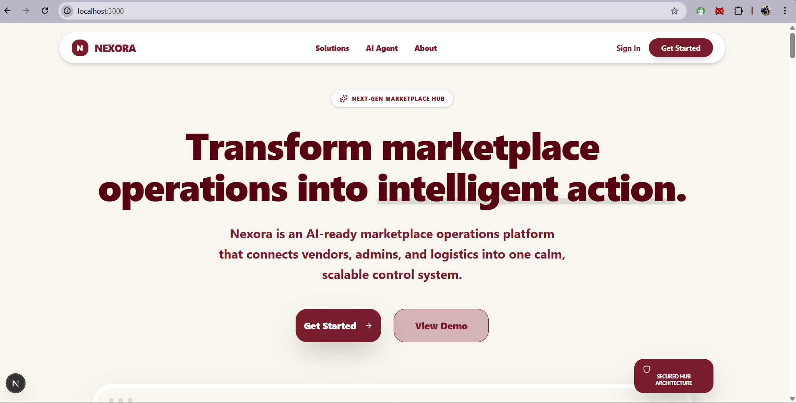

# Nexora

**Nexora** is an AI-ready marketplace operations platform designed to bring clarity, control, and intelligence to multi-vendor marketplaces.

It replaces scattered tools, spreadsheets, and manual coordination with a single, structured operational system for vendors and administrators.

---



## ✨ What is Nexora?

Nexora acts as a **control layer** for marketplace operations:

- **Vendors** execute daily operations (orders, products).
- **Admins** maintain visibility, intervene in issues, and ensure system health.
- **AI (NexoAI)** assists with contextual insights and guidance (human-in-the-loop).

The system is designed to be calm, scalable, and production-ready.

---

## 🧱 Core Features

### Vendor Panel
- **Inventory Management**: Add and track products with ease.
- **Order Fulfillment**: Streamlined process from Pending to Delivered.
- **Analytics**: Real-time tracked revenue and fulfillment rates.

### Admin Panel
- **Global Oversight**: Monitor all vendors and orders in one view.
- **Intervention**: Reassign or update stuck orders.
- **System Health**: View critical system-wide alerts.

### AI Layer (NexoAI)
- **Context-Aware Chat**: Specialized operational assistant.
- **Data-Driven**: Has read-access to live DB stats to answer questions like "How is my revenue?".
- **Safe**: Suggestions only, no autonomous writing without confirmation.

---

## 🧠 Design Principles

- **Role-Based Access**: Explicit separation between Admin and Vendor data.
- **Calm UI**: No noisy dashboards; progressive disclosure of information.
- **Assistive AI**: AI enhances the user, it doesn't replace them.
- **Architecture-First**: Scalable database schema and secure API patterns.

---

## 🛠️ Tech Stack

- **Frontend**: Next.js 15+ (App Router), Tailwind CSS, Shadcn UI
- **Backend**: API Routes (Serverless), Server Actions
- **Database**: PostgreSQL (Neon Serverless)
- **ORM**: Drizzle ORM
- **Auth**: Clerk (Role-based middleware)
- **AI**: Google Gemini (via Vercel AI SDK)

---

## 📂 Project Structure

```bash
src/
├── app/
│   ├── (vendor)/       # Vendor-specific routes
│   ├── (admin)/        # Admin-specific routes
│   └── api/            # Secure API endpoints
├── components/         # Shared UI components
├── config/             # Database & Schema config
├── lib/                # Utilities & Helpers
└── data/               # Static/Seed data
```

---

## 🔐 Environment Variables

Create a `.env` (or `.env.local`) file with the following keys:

```env
# Database (Neon/Postgres)
DATABASE_URL="postgres://..."

# Authentication (Clerk)
NEXT_PUBLIC_CLERK_PUBLISHABLE_KEY="pk_test_..."
CLERK_SECRET_KEY="sk_test_..."

# AI (Google Gemini)
GEMINI_API_KEY="AIzaSy..."
```

---

## 🚀 Getting Started

1. **Install Dependencies**
   ```bash
   npm install
   ```

2. **Database Setup**
   Push the schema to your Neon database:
   ```bash
   npx drizzle-kit push
   ```

3. **Run Development Server**
   ```bash
   npm run dev
   ```

   The app will be available at: `http://localhost:3000`

---

## 👨‍💻 Developed By

Vedant Talekar